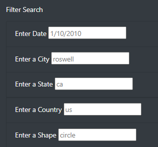
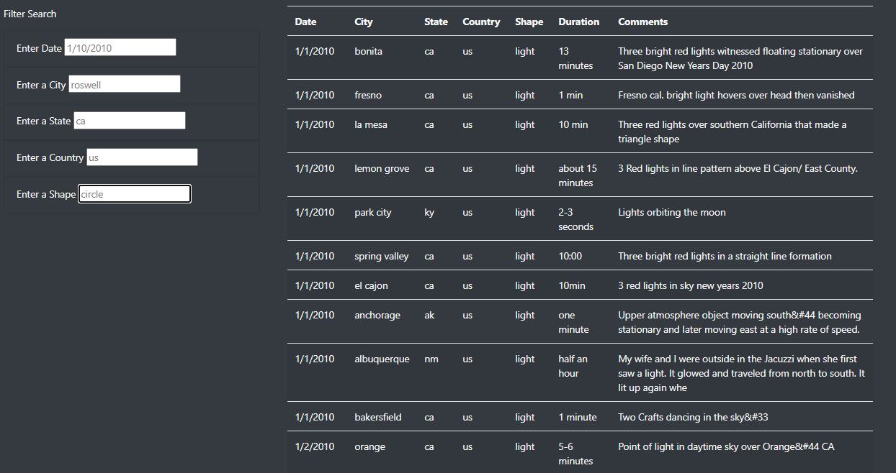
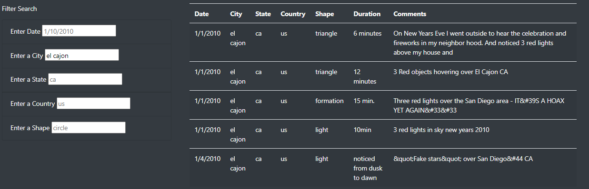
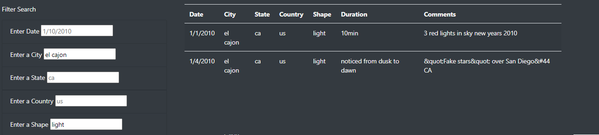

# UFOs: displaying UFO sighting data

## Overview
Dana wants to display UFO sighting data. She wants to display the data as a filterable table on a website so that viewers can sort the information to view sections that interest them. I created a website that shows her article and uses javascript to filter the sighting data.

## Results

### How to filter
1) Viewers can filter the information using the Filter Search section of the webpage (see **Image 1**).

**Image 1:** 

2) The user types in an appropriate value into one of the filters and then hits enter, tab, or clicks off of the filter input to trigger the filter.  E.g. if a user wants to filter for sights in el cajon, the table will go from the entire data set (see **Image 2**) to just those with el cajon as the city of sighting (see **Image 3**).

**Image 2:** Prior to filter application.

**Image 3:** Post filter application.

3) Filters can stack, so filtered results can be targeted.  (see **Image 4**).

**Image 4:** The appearance of the table before has been filtered for city = el cajon and shape = light.

4) Filters can be removed by deleting any text in the filter inputs.

## Summary
### Drawbacks
- The data is not filterable on the duration of the sighting.  The duration data would require transformation into a standardized format for this to work.  
- The filters are currently case sensitive. This could have effects on the data pulled out. 
### Further Development
- There is a great deal of information included in the comment about a sighting.  Adding a filter that checks whether a word or pattern is present in a comment would allow users to search for more obscure details about the sightings.
- Allowing users to utilize an advanced search keyword such as NOT would give users the power to exclude unwanted results.
